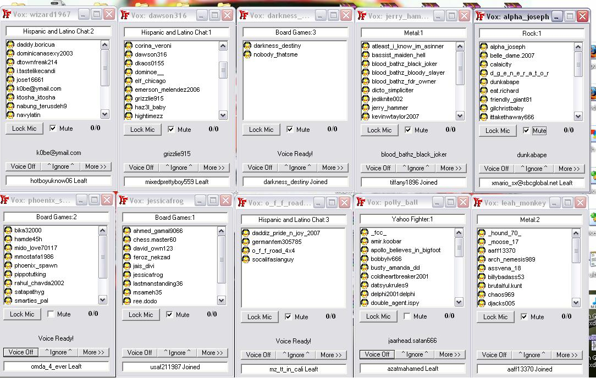



## Yahoo Multi Room Client/Vox's/Spammer

### Description

I Just made this over the last 2 days as an example of a New Idea i had and wanted to see what it would be like..

I myself still am learning...

You will find 1 list box functions module i state in there is borrowed.. an give thanks.

You will Find 1 Borrowed room names grabber Form, I give thanks on that form,

and state i didnt do that. This project was rushed but its pretty tight!! Check it out!

A Great Source you all can study to learn how to make Multiple yahoo login,

and Multiple Room Joining, Multiple Vox's for Each ID!

Can Tune into or DJ In multiple rooms,

Also with chat room display and send chat for 1 selected master chat bot at a time,

Yahoo client INF tag Processing, Multiple Room Spamming(Optional),

Mass names Collecting with Illy and "@" ID sorting, to Seperate List all Savable!

Each Bot has its own seperate Boot protection and more....Read the read me for more info...

The Chat Processing is Very rough an Raw tongue.gif but i didnt spend much time on that...

That all i have to say i hope this source helps many in future to think outside the box

And Creatively Invent New Usefull Non Existing Yah-Tools such as this one here....

Happy Learning

Oh and yes this project will be continued on much further, please dont RIP it.

But this is the only source for it getting shared, it has all the Main goods.
 
### More Info
 
Requires VB 6 to Run...

And the Following Dll's Registered to your system32!

-yacscom.dll

-YMSG12ENCRYPT.dll

-TABCTL32.OCX

-Richtx32.ocx

-MSWINSCK.OCX

-MSINET.OCX

-COMDLG32.OCX

-comctl32.ocx

Returns Yahoo Server Packets

No Side Effects

             |
---                |---
**Submitted On**   |2008-12-11 00:10:32
**By**             |[Dean Yahooz Fynest](https://github.com/Planet-Source-Code/PSCIndex/blob/master/ByAuthor/dean-yahooz-fynest.md)
**Level**          |Advanced
**User Rating**    |3.7 (22 globes from 6 users)
**Compatibility**  |VB 6\.0
**Category**       |[Miscellaneous](https://github.com/Planet-Source-Code/PSCIndex/blob/master/ByCategory/miscellaneous__1-1.md)
**World**          |[Visual Basic](https://github.com/Planet-Source-Code/PSCIndex/blob/master/ByWorld/visual-basic.md)
**Archive File**   |[Yahoo\_Mult21368212112008\.zip](https://github.com/Planet-Source-Code/dean-yahooz-fynest-yahoo-multi-room-client-vox-s-spammer__1-71516/archive/master.zip)

